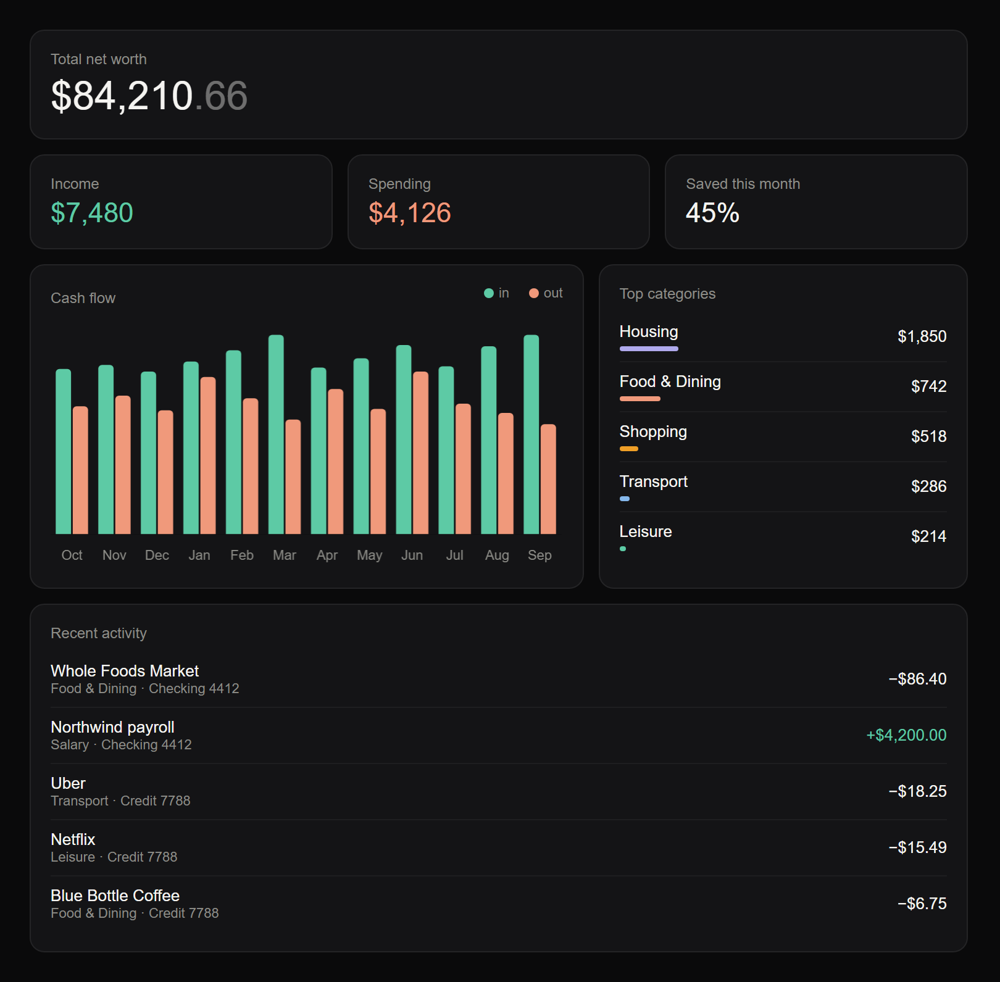
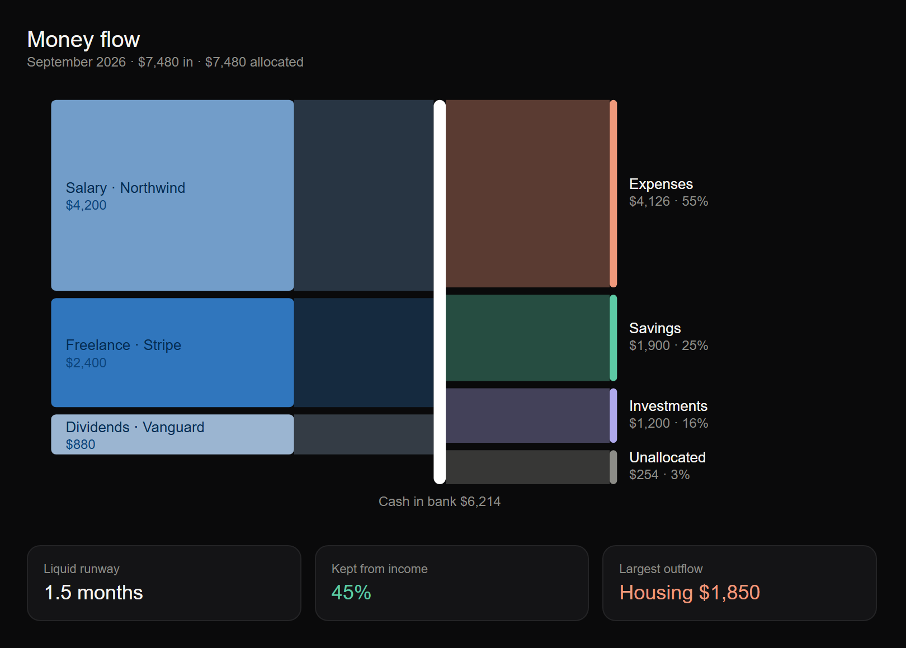
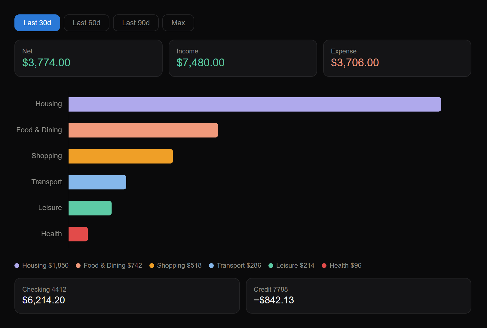
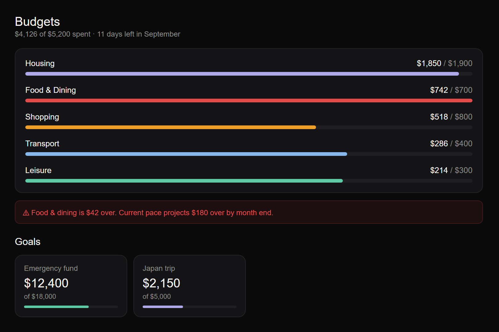
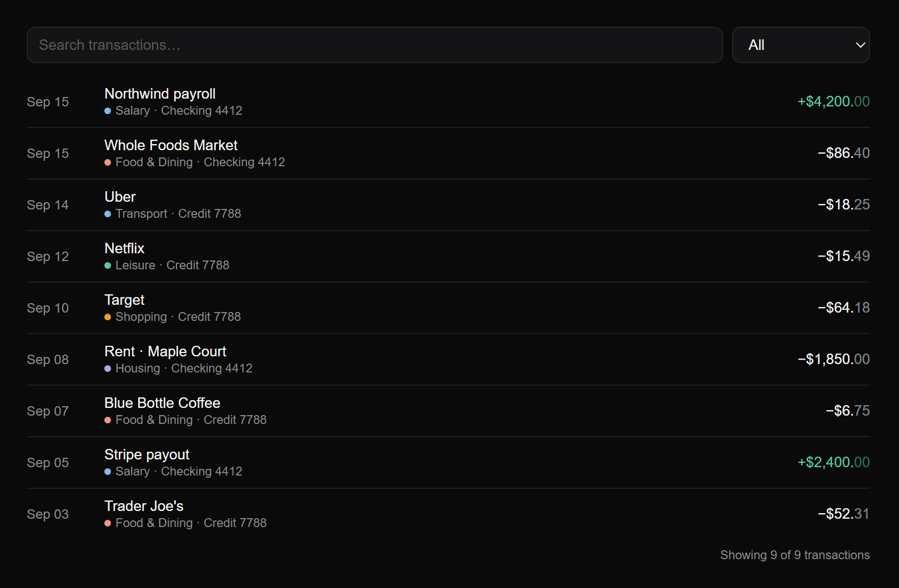

# Kuber

A local-first personal finance tracker that runs inside Claude. Connect your
bank accounts through Plaid, then just ask Claude about your money. It reads
your data directly and draws interactive charts right in the conversation.

There is no server to host, no database, and no dashboard to maintain. Your
data is a handful of CSV files on your machine, and the "app" is a
conversation.

- **Ask anything:** "How much did I spend on food last month?", "Am I over
  budget?", "What's my net worth?"
- **Inline visuals:** overview dashboard, spending by category, money-flow
  Sankey, budgets and goals, searchable transaction list.
- **Local by design:** nothing is stored in the cloud. The only outside calls
  are to Plaid, to sync your transactions.
- **Learns your merchants:** you confirm a category once and every future
  transaction from that merchant is classified automatically.

## Screenshots

These are rendered from the widget templates using made-up sample data.

| Dashboard | Money flow |
|---|---|
|  |  |

| Spending by category | Budgets and goals |
|---|---|
|  |  |

| Transactions |
|---|
|  |

## How it works

```
Plaid API ──> Python scripts ──> CSV files ──> Claude reads ──> Inline widgets
              (scripts/)         (data/)       and aggregates   (show_widget)
```

1. **Link** a bank through Plaid Link. A tiny local web page runs on
   `localhost` for this and nothing is hosted.
2. **Sync** pulls transactions incrementally using Plaid's cursor-based
   `/transactions/sync` API and writes them to `data/`.
3. **Ask.** Claude reads the CSVs, aggregates in context, and renders charts
   from the templates in `widgets/`, following the rules in `design/`.

Claude's behavior is defined by two things in this repo:

- [`CLAUDE.md`](CLAUDE.md): project instructions that Claude Code loads every
  session (data layout, session-start protocol, visualization rules,
  classification flow, security rules).
- [`.claude/commands/`](.claude/commands): the custom slash commands
  described [below](#custom-commands).

## Requirements

- **Python 3.10+**
- **[Claude Code](https://claude.com/claude-code)**: the CLI, the Code tab in
  the Claude desktop app, or an IDE extension. Custom slash commands and
  `CLAUDE.md` are Claude Code features.
- An environment where Claude can render inline widgets (the `show_widget`
  tool, available in the Claude desktop app). Without it, Claude can still
  answer questions from your data but cannot draw the charts.
- A **Plaid account with Production access**. See below.

### Plaid account

Kuber talks to real banks, so it uses Plaid's **Production** environment (it
refuses to run against Sandbox).

1. Sign up at <https://dashboard.plaid.com/signup>.
2. Request Production access and complete Plaid's onboarding for your use
   case. Check Plaid's current pricing and access tiers, since they change.
3. Copy your `client_id` and Production `secret` from
   <https://dashboard.plaid.com/developers/keys>.
4. Some large banks (Bank of America, Chase, Wells Fargo, and others) connect
   through OAuth and may need extra registration or approval in the Plaid
   dashboard before they appear in Link. If a bank says it is unsupported or
   is missing, check the OAuth institution status in your dashboard.

Kuber only requests the `transactions` product. It asks for `investments` as
*optional*, so banks that don't offer it still show up.

## Setup

```bash
git clone https://github.com/vizcodes/kuber.git
cd kuber
python -m venv .venv
```

Activate the virtual environment:

```bash
# macOS / Linux
source .venv/bin/activate
```

```powershell
# Windows (PowerShell)
.venv\Scripts\Activate.ps1
```

Then open the `kuber` folder in Claude Code and run the setup commands:

```
/setup
```

`/setup` asks for your Plaid `client_id` and secret, writes them to `.env`,
creates the `data/` directory with starter files, and installs dependencies.

```
/add-account
```

`/add-account` starts the local Plaid Link page and prints a URL
(`http://localhost:8765`). Open it in your browser, pick your bank, and log in.
When the flow finishes, Kuber saves the connection, pulls your accounts and
transactions, and tells you how many were imported. Run it again for each
additional bank.

That's it. Try `/dashboard`.

> **Manual setup, if you prefer:** copy `.env.example` to `.env`, fill in
> `PLAID_CLIENT_ID` and `PLAID_SECRET`, run `pip install -r requirements.txt`,
> then run `python scripts/plaid_link.py` yourself.

## Custom commands

Kuber ships a set of Claude Code
[custom slash commands](https://docs.claude.com/en/docs/claude-code/slash-commands).
Each command is a Markdown file in [`.claude/commands/`](.claude/commands). The
file's name is the command's name and its contents are the instructions Claude
follows when you run it. Open any of them to see exactly what it does, or edit
them to change how Kuber behaves.

| Command | What it does |
|---|---|
| `/setup` | First-time setup. Writes `.env` with your Plaid credentials, seeds `data/` (categories, empty budgets, goals and merchant rules), and installs dependencies. |
| `/add-account` | Links a bank via Plaid Link. Runs `scripts/plaid_link.py`, gives you a local URL to open, waits for you to finish, then reports the institution, accounts linked and transactions synced. |
| `/sync` | Refreshes data from Plaid by running `scripts/sync.py`, then reports how many transactions were added, modified or removed. |
| `/dashboard` | Overview: net worth, this month's income, spending and savings rate, a 12-month cash-flow chart, top categories and recent activity. |
| `/money-flow` | Sankey diagram of income sources flowing through your cash to expense categories and savings, plus runway, kept-from-income and largest outflow. Defaults to the current month. |
| `/spending` | Spending by category over 30, 60, 90 days or all time, with a category bar chart. |
| `/budgets` | Budget progress per category (bars cap at 100% and turn red when over) and savings goals. |
| `/transactions` | Searchable, filterable transaction list. |

You don't have to use commands. Plain questions work too ("what did I spend on
groceries in August?"), and Claude will read the same files. Commands are
shortcuts for the common views.

### Things Claude does automatically

`CLAUDE.md` defines a session-start routine. At the beginning of each session
Claude will:

1. Check that `.env` exists, and suggest `/setup` if not.
2. Check that a bank is linked, and suggest `/add-account` if not.
3. Run a sync if the last one was more than an hour ago, and mention it only
   if something changed.
4. Tell you if any transactions need classification.

### Setting budgets and goals

Just tell Claude in plain language: "set a $400 monthly budget for food" or
"create a savings goal of $5,000 for a trip by June". Claude writes the entry
to `data/budgets.csv` or `data/savings_goals.csv`, and `/budgets` shows
progress.

### Transaction classification

Plaid suggests a category for most transactions. Ones that are ambiguous are
flagged `needs_review`. Claude groups them by merchant, shows you batches of
5 to 10 with a suggested category, and applies your confirmation to every
transaction from that merchant. Each confirmation is saved to
`data/merchant_rules.csv`, so the same merchant never needs review again.

### Writing your own command

Create `.claude/commands/my-command.md`. The first line is the description, and
the rest is instructions for Claude. It becomes `/my-command`. A new visual
usually also needs an HTML template in `widgets/`.

## Data

Everything lives in `data/`, which is gitignored and never committed.

| File | What it holds |
|---|---|
| `plaid_items.json` | Plaid access tokens, item IDs and sync cursors. **Sensitive.** |
| `accounts.csv` | Linked accounts with balances |
| `transactions.csv` | All transactions with categories |
| `categories.csv` | Category definitions and their Plaid mapping |
| `budgets.csv` | Monthly budget limits |
| `savings_goals.csv` | Savings goals |
| `merchant_rules.csv` | Learned merchant to category overrides |

Notes on how Kuber reads the data:

- Credit card and loan balances are liabilities. Net worth subtracts them.
- Transfers between your own accounts (category `Transfer`) and credit card
  payments to a card you track should be excluded from income and spending so
  they aren't counted twice.

## Project layout

```
.claude/commands/   Custom slash commands (one Markdown file each)
CLAUDE.md           Instructions Claude loads every session
scripts/
  config.py         Reads .env, defines paths
  plaid_client.py   Thin wrapper around the Plaid SDK
  plaid_link.py     Local Plaid Link server used by /add-account
  sync.py           Incremental transaction and balance sync
widgets/            HTML templates for each visual
design/             Design rules, tokens and reference SVGs
docs/images/        README screenshots (sample data only)
data/               Your data (gitignored, created by /setup)
```

## Security and privacy

- Plaid keys live in `.env` and access tokens in `data/plaid_items.json`. Both
  are gitignored. **Never commit or share them.**
- All Plaid calls go through `scripts/`. Claude never calls Plaid directly and
  is instructed never to display or log tokens or secrets.
- Your transactions are read by Claude as part of your conversation, so they
  are subject to your Claude plan's data handling terms. Nothing else leaves
  your machine.
- The Plaid Link page binds to `127.0.0.1` only.
- If you ever fork or publish your copy, double-check `git status` first to
  confirm `.env` and `data/` are not staged.

## Troubleshooting

**"Timed out waiting for Plaid Link"**: the link script waits a limited time
for you to finish. Run `/add-account` again and complete the flow promptly.

**Port 8765 already in use**: an old `plaid_link.py` is still running. Stop it,
or set `PLAID_LINK_PORT` in `.env` to a different port.

**My bank says it isn't supported**: make sure you're on the latest version
(only `transactions` is required). Large OAuth banks may also need approval in
the Plaid dashboard.

**Linked, but 0 transactions**: Plaid can take a few minutes to pull history
after a first link. Wait, then run `/sync`.

**Numbers look doubled**: check that transfers and credit card payments are
being excluded (see [Data](#data)).

## Design

Charts follow a dark, minimal finance style. Color carries meaning: teal for
income and savings, coral for spending, red only when a budget is exceeded.
Two font weights, tabular figures, dimmed cents. See
[`design/design-reference.md`](design/design-reference.md) and
`design/tokens.json`.

## Contributing

Issues and pull requests are welcome. Please don't include real financial data,
screenshots of your accounts, or credentials in issues or PRs.

## License

[MIT](LICENSE)

## Disclaimer

Kuber is a personal tool, not financial advice, and is not affiliated with
Plaid or any bank. You are responsible for your own credentials and data.
